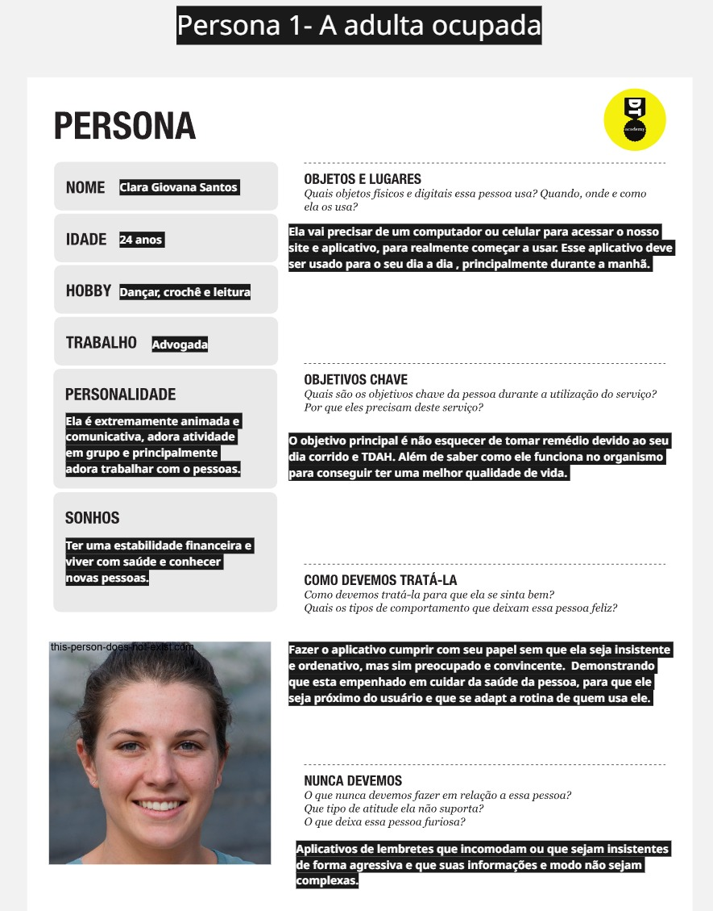
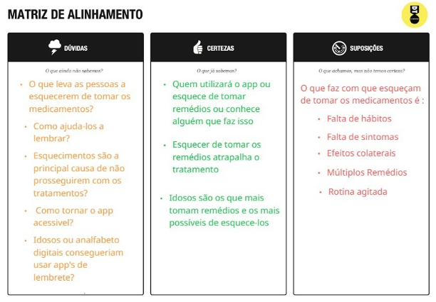
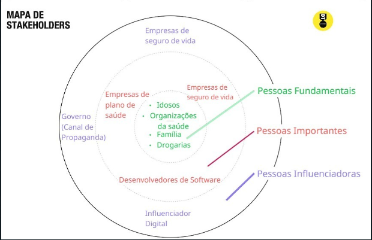
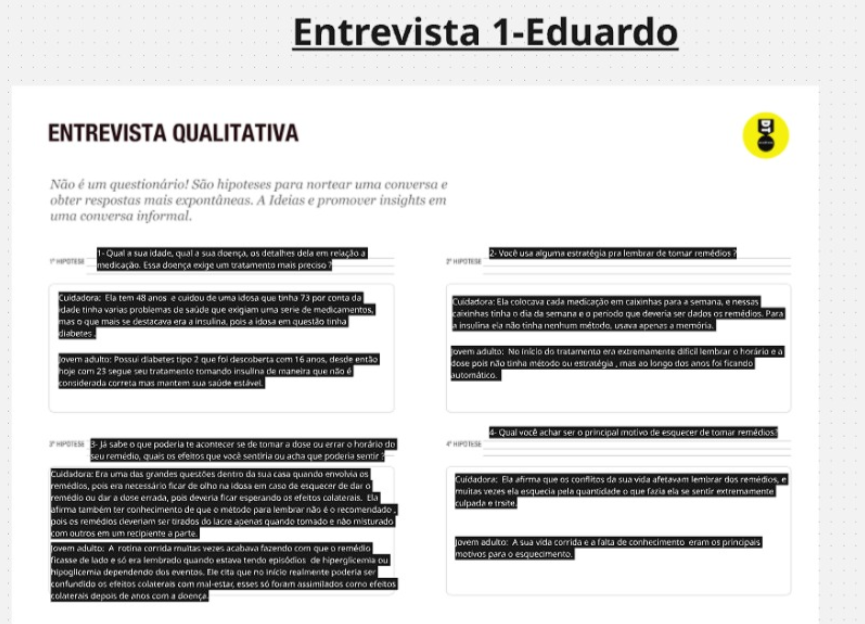
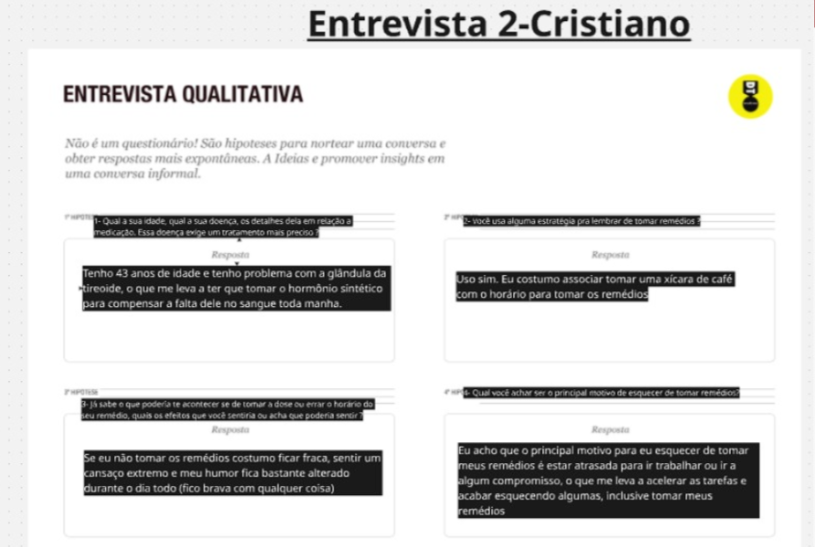
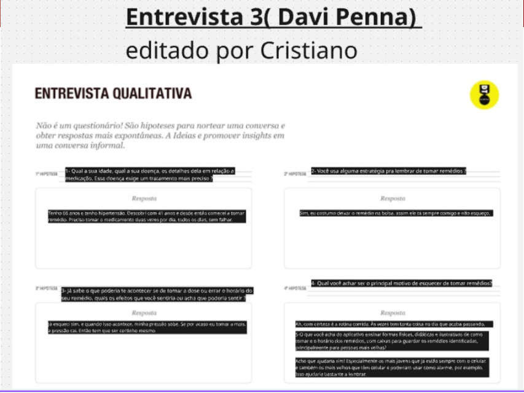
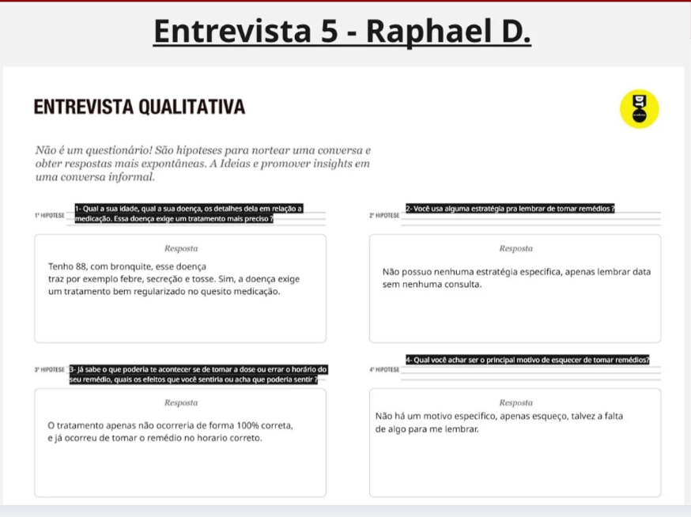
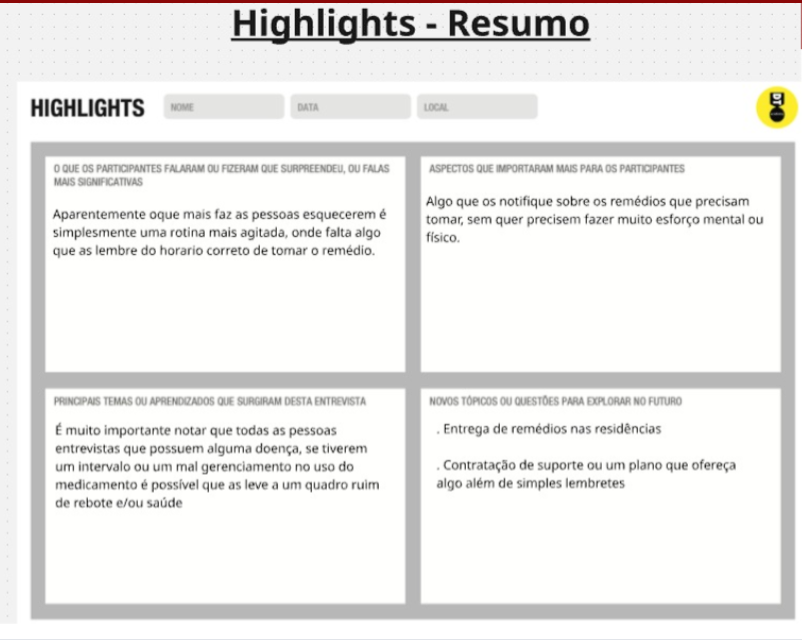
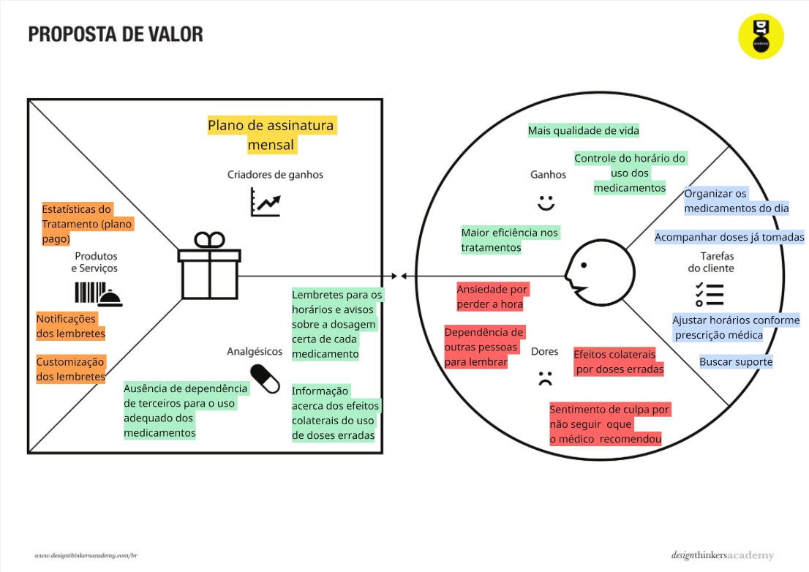
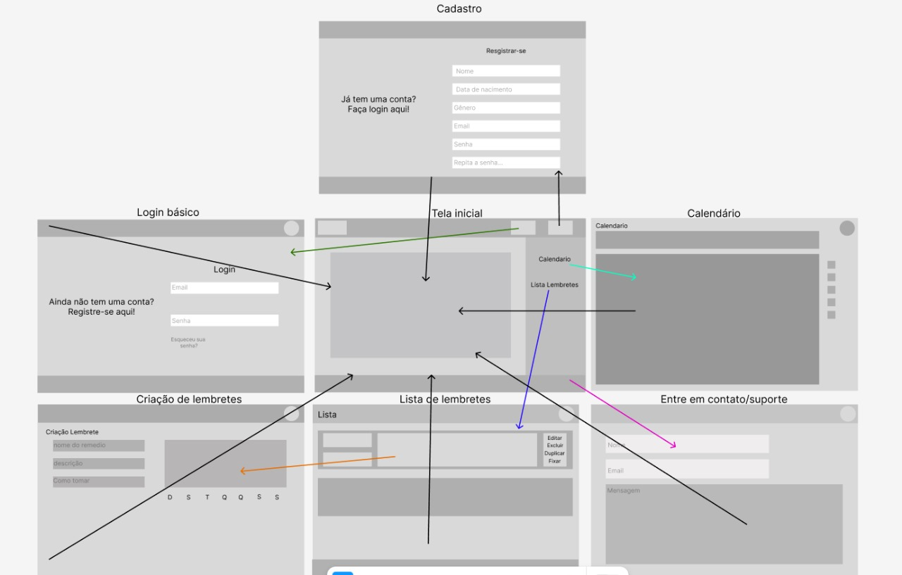

# Introdução

Informações básicas do projeto.

* *Projeto:* [Lembrete de remédios(Remedicy)]
* *Repositório GitHub:* [ICEI-PUC-Minas-PMGCC-TI/ti-1-pmg-cc-m1-2025-1-atividade_01-ti1-template]
* *Membros da equipe:*

  * [Cristiano de Avelar Marques Pires](https://github.com/crigate170) 
  * [Davi Penna da Silva](https://github.com/DaviPennadSilva) 
  * [Eduardo Borges de Souza](https://github.com/EduardoBO4) 
  * [Henrique Cesar Silva Carvalho](https://github.com/HenriqueCesarSilvaCarvalho)
  * [Raphael Dantas de Castro](https://github.com/OrangiR) 

  
  

A documentação do projeto é estruturada da seguinte forma:

1. Introdução
2. Contexto
3. Product Discovery
4. Product Design
5. Metodologia
6. Solução
7. Referências Bibliográficas

✅ [Documentação de Design Thinking (MIRO)](https://miro.com/app/board/uXjVITq_x2M=/?share_link_id=275512533063)
Usamos o Miro para desenvolver nossas ideias principais em vários perfis diferentes, de cada membro do grupo, como o exemplo do link acima, que mostra um desses perfis e como foi feito nesse caso.

# Contexto

Esse problema foi retirado das discussões em sala de aula. Posteriormente, por meio de pesquisas de campo e revisão bibliográfica, percebemos o grau elevado que a problemática revela. Segundo pesquisas, a maior parte dos motivos para os tratamentos não funcionarem bem é devido ao esquecimento. Então, pensamos em um site de alarmes e notificações para ajudar as pessoas a manterem o tratamento, diminuindo a ocorrência da problemática.

## Problema
Nossa aplicação tem como objetivo ajudar pessoas a não esquecerem de tomar seus remédios nos horários corretos, evitando assim comprometer o tratamento de forma prejudicial.

## Objetivos
Nosso trabalho tem como objetivo ajudar geralmente pessoas que utilizam remédios controlados de uso contínuo oferencendo a elas uma plataforma de monitoramento dos medicamentos;
Temos que fazer da plataforma o mais organizado, acolherdor e intuitivo para que o usuario nao se estresse com as notificações;
Temos que pensar como faremos dessa plataforma produtiva e autosustentável.

## Justificativa
Como um dos integrantes do grupo tem TDAH ao conversar sobre possiveis temas que poderiamos abordar, foi sugerido o tema lembrete de remédios devido aos relatos dele tanto de como ele vive esquecendo de tomar seus medicamentos e tambem dos colegas que ele tinha que fazia prova sala separada junto dele tambem viviam esquecendo. O que afetava muito o desempenho de todos. Dessa forma ficou evidente que o esquecimento da hora de tomar os remédios trás um dor imensa a vida dessas pessoas. Se com adolescentes isso acontece, imagine com idosos!
Dados: Segundo Shalini S. Lynch (Health Sciences Clinical Professor of Pharmacy at UCSF) a principal justificativa para as pessoas não aderirem de maneira correta aos tratamentos medicamentoso é o esquecimento. 

## Público-Alvo

O público-Alvo que nosso projeto procura focar são expecialmente idosos mas também qualquer tipo de pessoas que faça o uso de remédios controlados cotidianamente 
;
;
> 
#Product Discovery

## Etapa de Entendimento

> Nessa etapa, vamos trabalhar com a metdologia de Design Thinking para compreender com maior profundidade o problema a ser tratado. Nesse processo, vamos elaborar:
> 
>* *Matriz CSD*: Também conhecida por Matriz de Alinhamento, é uma ferramenta utilizada no Design Thinking para organizar informações e facilitar o processo de tomada de decisão e solução de problemas.

> * *Mapa de stakeholders*: Ferramenta que nos permite compreender o grupo de pessoas e entidades que devemos estudar e conversar para entender mais sobre o problema.

> * *Entrevistas qualitativas*: Série de entrevistas qualitativas para validar suposições e solucionar as dúvidas com as principais pessoas envolvidas.





> * *Highlights de pesquisa*: Um compilado do levantamento realizado por meio das entrevistas.

## Etapa de Definição

### Personas
Entendemos que, para a nossa aplicação, qualquer pessoa que tome remédios ou esteja em meio a um tratamento pode utilizá-la, sendo esse nosso público geral. Porém, também entendemos que nossas personas giram em torno de pessoas que tomam remédios, fazem tratamentos contínuos ou têm alguma questão de memória ou distração, o que resulta em esquecer de tomar os remédios.
Como exemplo da nossa Persona 1, temos uma mulher chamada Clara de 24 anos que, além de trabalhar e estudar, dedica-se a atividades físicas. Ela também convive com diabetes tipo 2 e tem TDAH. Essa persona é um excelente exemplo do público que se beneficiaria da nossa solução, pois sua rotina é extremamente corrida, ela lida com uma doença crônica que a acompanhará ao longo da vida e enfrenta desafios de memória e foco devido à neurodivergência. Portanto, nossa solução seria uma forma ideal de apoiá-la na organização de sua rotina e no cumprimento do seu tratamento.
Outro exemplo é a nossa Persona 2, Matheus, um homem de 56 anos que, além de trabalhar, tem a responsabilidade de cuidar de sua família. Seu pai idoso, que precisa de cuidados especiais, é quem mais exige atenção, principalmente quando se trata de medicação, já que ele precisa seguir uma série de tratamentos e tomar diversos medicamentos para manter sua saúde. Além disso, Matheus também toma alguns remédios, o que o torna um usuário em potencial para a nossa solução, que poderia ajudá-lo a gerenciar melhor tanto os cuidados com seu pai quanto os próprios tratamentos.

# Product Design

Nesse momento, vamos transformar os insights e validações obtidos em soluções tangíveis e utilizáveis. Essa fase envolve a definição de uma proposta de valor, detalhando a prioridade de cada ideia e a consequente criação de wireframes, mockups e protótipos de alta fidelidade, que detalham a interface e a experiência do usuário.

## Histórias de Usuários

Com base na análise das personas foram identificadas as seguintes histórias de usuários:

1 - Eu, a pessoa que às vezes esquece meus remédios nos momentos em que estou mais sobrecarregado ou cansado, quero poder receber notificações que me lembrem de minhas metas de saúde e motivos pra seguir o tratamento, pois assim posso ser lembrado a qualquer momento.
2 - Notificação sobre a importância de manter hábitos saudáveis, como praticar atividades físicas, que ajudam junto com o tratamento.
3 - Alertas e Notificações Inteligentes:  - Alertas com som e imagem no celular;  - Confirmação de dose (usuário marca se “tomou” ou “adiar”);  4 - Eu como alguém que esquece sempre de tomar meus remédios, queria receber notificações ao longo do dia com historias reais de pessoas que pararam de tomar e tiveram problemas, pra me dar aquele choque de realidade e não esquecer mais.
5 - Eu, a pessoa que busca melhorar minha saúde com o uso correto de remédios, quero poder ver os horários do dia em que mais esqueço ou tenho dificuldade de lembrar, assim posso me organizar melhor e evitar essas falhas.
6 - Posts falando dos riscos de parar de tomar remédio sem medico e como manter o tratamento direitinho melhora muito a qualidade de vida.
7 - Eu, como alguém que tem dificuldade em manter a rotina de remédios, queria um app que me motivasse com mensagens legais e historias de superação de outras pessoas, pra eu não desistir de tomar certinho.
8- Funcionalidades sobre:
    -Notificar o usuário quando for necessário comprar uma nova cartela de remédios ;
   - Grupo familiar de pessoas que consigam acessar e acompanhar o tratamento de um mesmo usuário;
   -Uma mesma conta consiga acompanhar o tratamento de varias pessoas diferentes (filhos acompanhando o  tratamento do pai por exemplo,).

> Orientações:
> 
>- [Histórias de usuários com exemplos e template](https://www.atlassian.com/br/agile/project-management/user-stories)
> - [Como escrever boas histórias de usuário (User Stories)](https://medium.com/vertice/como-escrever-boas-users-stories-hist%C3%B3rias-de-usu%C3%A1rios-b29c75043fac)

## Proposta de Valor



##### Proposta para Persona XPTO


## Requisitos

As tabelas que se seguem apresentam os requisitos funcionais e não funcionais que detalham o escopo do projeto.

### Requisitos Funcionais

| ID     | Descrição do Requisito                                   | Prioridade |
| ------ | ---------------------------------------------------------- | ---------- |
| RF-001 | Permitir que o usuário cadastre horários e datas | ALTA  |
| RF-002 | Emitir no final de cada mês estatísticas         | MÉDIA |
| RF-003 | Notificações personalizadas                      | ALTA  |
| RF-004 | Informação acerca dos efeitos colaterais         | BAIXA |


### Requisitos não Funcionais

| ID      | Descrição do Requisito                                                              | Prioridade |
| ------- | ------------------------------------------------------------------------------------- | ---------- |
| RNF-001 | O sistema deve ser responsivo para rodar em um dispositivos móvel| ALTA |
| RNF-002 | Facilidade de Navegação | BAIXA |
| RNF-001 | Compatibilidade com navegadores | MÉDIO |
| RNF-002 | Desempenho: Interações de no máximo 2.5 segundos | ALTA |
> 


## Projeto de Interface

### Wireframes

Estes são os protótipos de telas do sistema.



##### TELA XPTO 

Descrição para a tela XPTO


### User Flow


### Protótipo Interativo
 [Protótipo Interativo (Figma)](https://www.figma.com/proto/PRi6Jtl4xPX1nnvQmc91sr/Untitled?node-id=20-2&p=f&t=IE9kzIedYfDvG8Jd-1&scaling=min-zoom&content-scaling=fixed&page-id=0%3A1&starting-point-node-id=20%3A2)

# Metodologia

Nós nos dividimos igualmente para cada tarefa, nenhum ficou responsavel 100% por uma coisa, usamos o figma e o miro para todo o projeto ate o atual momento.

## Ferramentas

Relação de ferramentas empregadas pelo grupo durante o projeto.

| Ambiente                    | Plataforma | Link de acesso                                     |
| --------------------------- | ---------- | -------------------------------------------------- |
| Processo de Design Thinking | Miro       | https://miro.com/XXXXXXX ⚠️ EXEMPLO ⚠️            |
| Repositório de código       | GitHub     | https://github.com/XXXXXXX ⚠️ EXEMPLO ⚠️            |
| Hospedagem do site          | Render     | https://site.render.com/XXXXXXX ⚠️ EXEMPLO ⚠️     |
| Protótipo Interativo        | MarvelApp  | https://marvelapp.com/XXXXXXX ⚠️ EXEMPLO ⚠️        |
|                             |            |                                                    |

> ⚠️ **APAGUE ESSA PARTE ANTES DE ENTREGAR SEU TRABALHO**
>
> Liste as ferramentas empregadas no desenvolvimento do projeto, justificando a escolha delas, sempre que possível. Inclua itens como: (1) Editor de código, (2) )ferramentas de comunicação, (3) )ferramentas de diagramação, (4) )plataformas de hospedagem, entre outras.

## Gerenciamento do Projeto

Divisão de papéis no grupo e apresentação da estrutura da ferramenta de controle de tarefas (Kanban).


Nossa organização foi guiada, principalmente, por dois meios: o WhatsApp e o Kanban. Utilizávamos o Kanban como uma ferramenta visual para acompanhar o andamento das atividades que precisavam ser realizadas, permitindo que todos tivessem uma visão geral do progresso do projeto.

No entanto, raramente utilizávamos a coluna “Concluído” no Kanban, pois, para nosso grupo, essa informação não agregava tanto. Quando uma tarefa desaparecia do quadro, já entendíamos que ela havia sido finalizada, visto que a conclusão era sempre comunicada diretamente pelo WhatsApp.

Além do Kanban, uma ferramenta extremamente útil no nosso processo de organização foi o GitHub. Por meio de commits com mensagens bem explicativas, conseguimos indicar claramente o início e a finalização de cada alteração. Isso foi essencial para manter a organização do projeto e praticamente eliminou os problemas de conflito de merge, que ocorrem quando duas pessoas editam a mesma parte do código simultaneamente.


Outro fator que contribuiu bastante para a organização foi a divisão prévia de responsabilidades. Antes mesmo de começarmos o desenvolvimento do site, definimos qual página seria responsabilidade de cada integrante. Mesmo que uma página envolvesse funcionalidades de interesse de várias pessoas, ela tinha um responsável principal. Assim, qualquer alteração desejada por outros membros naquela página deveria ser previamente comunicada ao responsável, que auxiliava no processo e, se necessário, estabelecia limites para garantir o bom andamento das tarefas e evitar retrabalho.

# Solução Implementada

Esta seção apresenta todos os detalhes da solução criada no projeto.

## Vídeo do Projeto

O vídeo a seguir traz uma apresentação do problema que a equipe está tratando e a proposta de solução. ⚠️ EXEMPLO ⚠️

[](https://www.youtube.com/embed/70gGoFyGeqQ)

> ⚠️ **APAGUE ESSA PARTE ANTES DE ENTREGAR SEU TRABALHO**
>
> O video de apresentação é voltado para que o público externo possa conhecer a solução. O formato é livre, sendo importante que seja apresentado o problema e a solução numa linguagem descomplicada e direta.
>
> Inclua um link para o vídeo do projeto.

## Funcionalidades

Esta seção apresenta as funcionalidades da solução.Info

##### Funcionalidade 1 - Cadastro de Contatos ⚠️ EXEMPLO ⚠️

Permite a inclusão, leitura, alteração e exclusão de contatos para o sistema

* **Estrutura de dados:** [Contatos](#ti_ed_contatos)
* **Instruções de acesso:**
  * Abra o site e efetue o login
  * Acesse o menu principal e escolha a opção Cadastros
  * Em seguida, escolha a opção Contatos
* **Tela da funcionalidade**:


> ⚠️ **APAGUE ESSA PARTE ANTES DE ENTREGAR SEU TRABALHO**
>
> Apresente cada uma das funcionalidades que a aplicação fornece tanto para os usuários quanto aos administradores da solução.
>
> Inclua, para cada funcionalidade, itens como: (1) titulos e descrição da funcionalidade; (2) Estrutura de dados associada; (3) o detalhe sobre as instruções de acesso e uso.

## Estruturas de Dados

Descrição das estruturas de dados utilizadas na solução com exemplos no formato JSON.Info

##### Estrutura de Dados - Contatos   ⚠️ EXEMPLO ⚠️

Contatos da aplicação

```json
  {
    "id": 1,
    "nome": "Leanne Graham",
    "cidade": "Belo Horizonte",
    "categoria": "amigos",
    "email": "Sincere@april.biz",
    "telefone": "1-770-736-8031",
    "website": "hildegard.org"
  }
  
```

##### Estrutura de Dados - Usuários  ⚠️ EXEMPLO ⚠️

Registro dos usuários do sistema utilizados para login e para o perfil do sistema

```json
  {
    id: "eed55b91-45be-4f2c-81bc-7686135503f9",
    email: "admin@abc.com",
    id: "eed55b91-45be-4f2c-81bc-7686135503f9",
    login: "admin",
    nome: "Administrador do Sistema",
    senha: "123"
  }
```

> ⚠️ **APAGUE ESSA PARTE ANTES DE ENTREGAR SEU TRABALHO**
>
> Apresente as estruturas de dados utilizadas na solução tanto para dados utilizados na essência da aplicação quanto outras estruturas que foram criadas para algum tipo de configuração
>
> Nomeie a estrutura, coloque uma descrição sucinta e apresente um exemplo em formato JSON.
>
> **Orientações:**
>
> * [JSON Introduction](https://www.w3schools.com/js/js_json_intro.asp)
> * [Trabalhando com JSON - Aprendendo desenvolvimento web | MDN](https://developer.mozilla.org/pt-BR/docs/Learn/JavaScript/Objects/JSON)

## Módulos e APIs

Esta seção apresenta os módulos e APIs utilizados na solução

**Images**:

* Unsplash - [https://unsplash.com/](https://unsplash.com/) ⚠️ EXEMPLO ⚠️

**Fonts:**

* Icons Font Face - [https://fontawesome.com/](https://fontawesome.com/) ⚠️ EXEMPLO ⚠️

**Scripts:**

* jQuery - [http://www.jquery.com/](http://www.jquery.com/) ⚠️ EXEMPLO ⚠️
* Bootstrap 4 - [http://getbootstrap.com/](http://getbootstrap.com/) ⚠️ EXEMPLO ⚠️

> ⚠️ **APAGUE ESSA PARTE ANTES DE ENTREGAR SEU TRABALHO**
>
> Apresente os módulos e APIs utilizados no desenvolvimento da solução. Inclua itens como: (1) Frameworks, bibliotecas, módulos, etc. utilizados no desenvolvimento da solução; (2) APIs utilizadas para acesso a dados, serviços, etc.

# Referências

As referências utilizadas no trabalho foram:

* SOBRENOME, Nome do autor. Título da obra. 8. ed. Cidade: Editora, 2000. 287 p ⚠️ EXEMPLO ⚠️

> ⚠️ **APAGUE ESSA PARTE ANTES DE ENTREGAR SEU TRABALHO**
>
> Inclua todas as referências (livros, artigos, sites, etc) utilizados no desenvolvimento do trabalho.
>
LYNCH, S. Aderência ao tratamento medicamentoso. Disponível em: https://www.msdmanuals.com/pt/casa/medicamentos/fatores-que-afetam-a-resposta-medicamentosa/ader%C3%AAncia-ao-tratamento-medicamentoso. Acesso em: 22 jun. 2025.

ROCHA, Andréa Soares da; RIBEIRO, Iara Siqueira de Lima; OLIVEIRA, Renata Coelho de; et al. Dificuldades no uso de medicamentos por idosos acompanhados em uma coorte do Sul do Brasil. Revista Brasileira de Epidemiologia, v. 26, 2023. DOI: 10.1590/1980-549720230020.2. Disponível em: https://www.scielo.br/j/rbepid/a/fsM3pN6YmXXWLXhgM5MBZMh/?lang=pt. Acesso em: 22 jun. 2025.

SOBRAL, Pollyanna Dutra; OLIVEIRA, Dinaldo Cavalcanti; GOMES, Eduardo Tavares; CARVALHO, Priscila de Oliveira; BRITO, Norma Maria Tenório; OLIVEIRA, Danielle Aparecida Gomes Cavalcanti de; ARAGÃO, Erlley Raquel; GODOI, Emanuelle Tenório. Razões para não adesão a fármacos em pacientes com doença arterial coronariana. Revista da Sociedade Brasileira de Clínica Médica, v. 15, n. 3, p. 166-170, 2017. Disponível em: https://www.revista.sbcm.org.br/index.php/rsbcm/article/view/288. Acesso em: 22 jun. 2025.
> **Orientações**:
>
> - [Formato ABNT](https://www.normastecnicas.com/abnt/trabalhos-academicos/referencias/)
> - [Referências Bibliográficas da ABNT](https://comunidade.rockcontent.com/referencia-bibliografica-abnt/)
